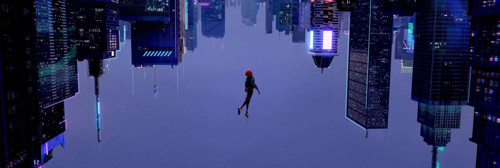

# Hello 👋, I'm Kavisha

### IT Undergraduate

Building meaningful software while learning, experimenting, and solving problems.

## 🚀 About Me

I'm **Kavisha Nethsara**, an IT undergraduate at the **University of Moratuwa**.

I enjoy learning how software works from the fundamentals and turning ideas into working projects.

Currently, I'm strengthening my knowledge in **C programming, Data Structures & Algorithms, Web Development, Databases, and Software Engineering**.

I'm always interested in exploring new technologies, building projects, and improving my problem-solving skills.

## 🤝 Connect

## 💻 Tech Stack

### Languages

### Tools & Technologies

### ✨ Thanks for visiting my profile!

